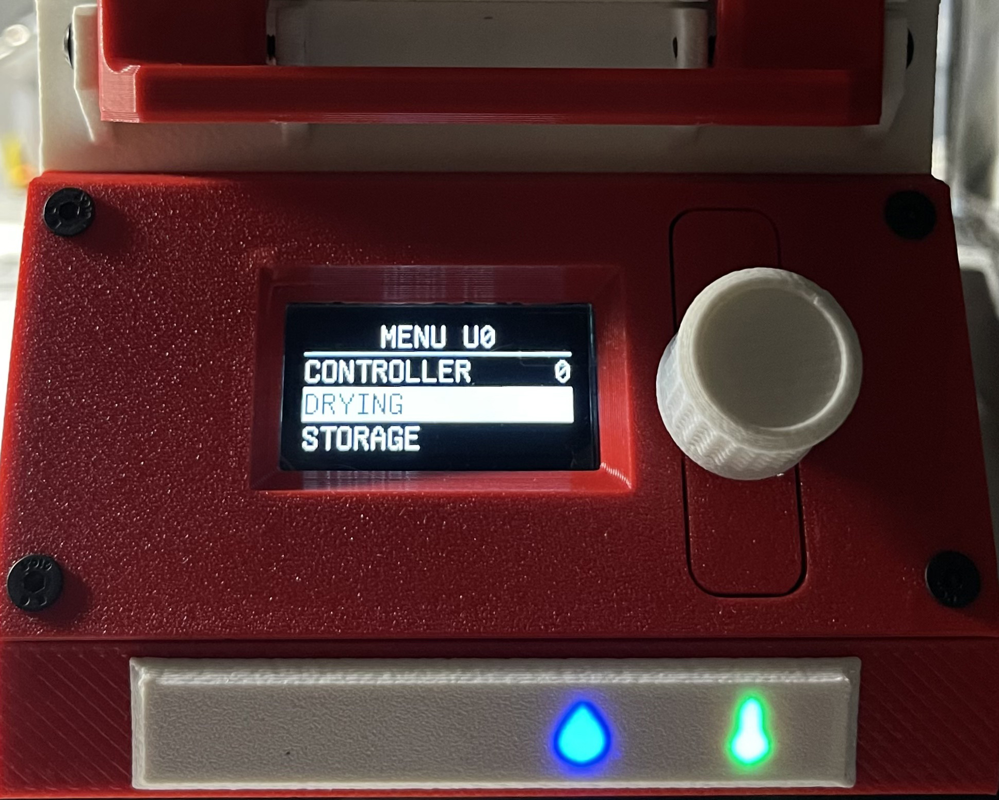
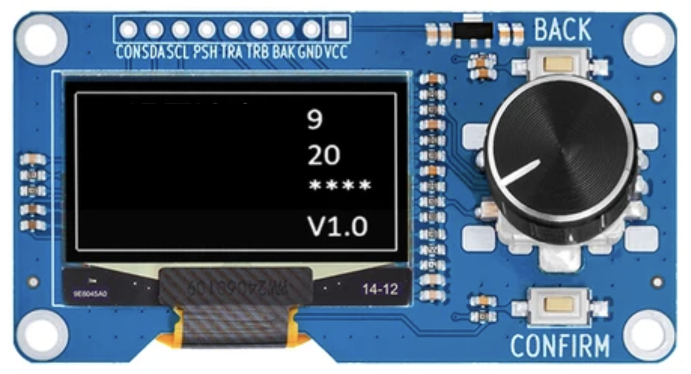
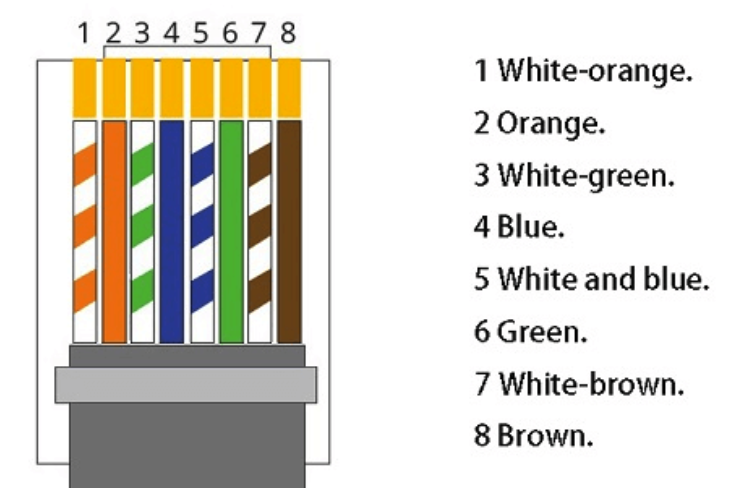
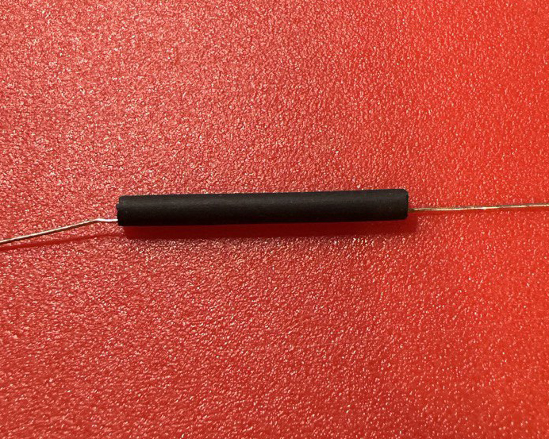
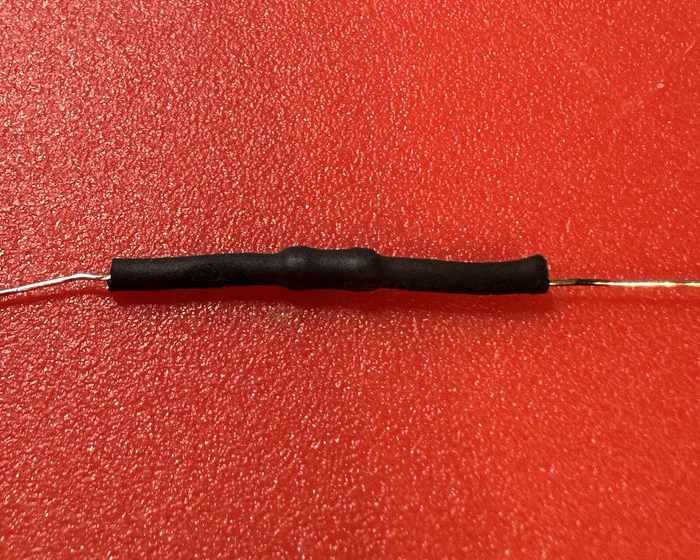
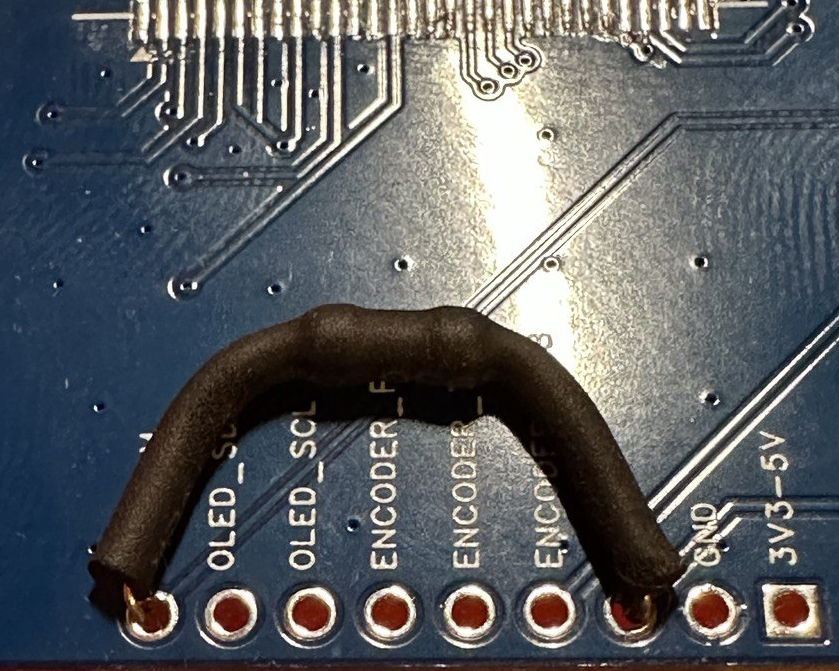
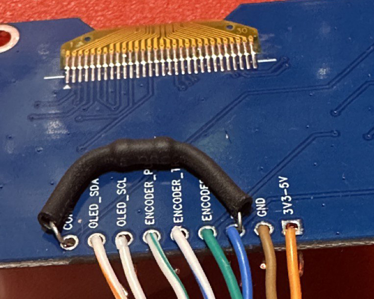

# OLED-Bildschirm über RJ45 anschließen

Der OLED-Bildschirm ist nicht erforderlich: Das Gerät kann über Link und das Portal funktionieren.
Nach dem ersten Flashen wird normalerweise ein Szenario mit Link auf `PORT 2` verwendet: Link konfigurieren, mit Wi-Fi verbinden, und das Gerät erscheint im Portal.

In einigen Szenarien ist ein lokaler Bildschirm jedoch praktischer oder notwendig:

- kein Wi-Fi am Installationsort;
- autonome Nutzung ohne Portal erforderlich;
- Produktions-/Servicestationen, wo eine lokale Benutzeroberfläche wichtig ist.

## Bildschirm



## Modellauswahl



Überprüfen Sie beim Auswählen des Bildschirms unbedingt die Stromversorgung in der Modellbeschreibung.
Es muss `3.3-5V` unterstützt werden.
Ein nur auf `5V` ausgelegter Bildschirm beschädigt den Mikrocontroller.

[OLED 1.3 KAUFEN](https://www.aliexpress.com/item/1005008126409440.html)

## RJ45-Pinbelegung

- `1 (WO)` -> `SDA`
- `2 (O)` -> `VCC`
- `3 (WG)` -> `PSH`
- `4 (B)` -> `BAK/CON`
- `5 (WB)` -> `TRA`
- `6 (G)` -> `TRB`
- `7 (WBr)` -> `SCL`
- `8 (Br)` -> `GND`

## Schaltplan

Verbinden Sie `CON-BAK` und installieren Sie einen Drahtwiderstandes `10 kΩ, 0,25 W`.
Dies ermöglicht die korrekte Verwendung der Funktionalität beider Tasten.

Wichtig:

- Kurzschlüsse der stromleitenden Teile vermeiden;
- Wärmeschrumpfschlauch oder Isolierband zur Isolierung der Verbindungen verwenden.



```text
 _______________(R10kΩ)________________
 |                                    |
CON | SDA | SCL | PSH | TRA | TRB | BAK | GND | VCC
 |     |     |     |     |     |     |     |     |
     1(WO) 7(WBr)3(WG) 5(WB) 6(G)  4(B)  8(Br) 2(O)
```

## Verbindungsfotos








