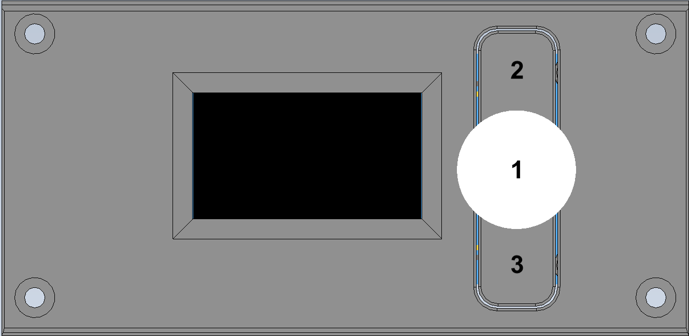

# iDryer RP2040: menu manual

## How to read the menu

- `global` means one shared value for the whole device.
- `per controller` means a separate value for each UNIT.
- `toggle` items are shown as `ON/OFF` in UI.
- Some `uint8` values are rendered as text in UI:
  - `LANGUAGE`: `0=RU`, `1=EN`
  - `PORT 1/2/3`: `EXT/SCR/SCL/LNK` (see GLOBAL -> PORT CONFIG)

## Controls

1. Encoder.
    - Rotate — navigate menu items, change values.
    - Press — confirm selection.
    - Press and hold — go back (when editing, exits without saving changes).
2. Button. Switch active UNIT.
3. Button.
    - Hold — end current mode.
    - Long hold — end modes on all UNITs.
    - Long hold on error — reset error.

## MENU top level

1. `CONTROLLER`
2. `DRYING`
3. `STORAGE`
4. `PROFILE`
5. `PRESETS`
6. `SCALES`
7. `SETTINGS`
8. `GLOBAL`

## CONTROLLER (global)

| Item | Type | Range | Default | Logic |
|---|---|---|---|---|
| `CONTROLLER` | value | `0..2` | `0` | Selects active UNIT. All `per controller` items are edited for this UNIT. On change, value is clamped to `units_count-1`. |

## DRYING (per controller)

| Item | Type | Range | Default | Logic |
|---|---|---|---|---|
| `TEMPERATURE` | value | `30..110 °C`, step `1` | `60` | Target air temperature for drying. |
| `TIME` | value | `0..600 min`, step `1` | `240` | Drying duration. |
| `START` | action | - | - | Starts Drying mode for active UNIT. If `Temp` or `Time` is `0`, fallback values `60 °C` and `30 min` are used. |

Drying timer logic:

- Countdown does not start at `START` press.
- Countdown starts when air temperature enters `±1 °C` band around target.
- When time expires:
  - if `SETTINGS -> STORAGE -> AUTO STORAGE = ON`, controller switches to Storage;
  - if `OFF`, controller stops (Idle).

## STORAGE (per controller)

| Item | Type | Range | Default | Logic |
|---|---|---|---|---|
| `TEMPERATURE` | value | `35..90 °C`, step `1` | `45` | Base storage temperature (when temperature-priority control is used). |
| `HUMIDITY` | value | `5..30 %RH`, step `1` | `12` | Target humidity for humidity-priority control. |
| `BY HUMIDITY` | toggle | `ON/OFF` | `ON` | `ON`: humidity priority. `OFF`: temperature priority. |
| `START` | action | - | - | Starts Storage mode with current active UNIT settings. |

Storage logic:

- If humidity priority is `ON`, heating is toggled by RH hysteresis and `MIN HOLD` (see SETTINGS -> STORAGE).
- If humidity priority is `OFF`, storage temperature target is maintained.

## PROFILE (per controller)

### PROFILE START

| Item | Type | Range | Default | Logic |
|---|---|---|---|---|
| `FIRST STAGE` | value | `1..10`, step `1` | `1` | First profile stage to start from. |
| `PROFILE START` | action | - | - | Starts 10-stage profile for active UNIT. |

### STAGES 01..10

Each stage has:

- `TEMPERATURE`: `30..110 °C`, step `1`
- `RAMP`: `0..1200 min`, step `1`
- `HOLD`: `0..1200 min`, step `1`

Default values:

| Stage | Temp, °C | Ramp, min | Hold, min |
|---|---:|---:|---:|
| 01 | 50 | 5 | 1 |
| 02 | 60 | 5 | 1 |
| 03 | 70 | 5 | 1 |
| 04 | 60 | 5 | 1 |
| 05 | 50 | 5 | 1 |
| 06 | 70 | 5 | 1 |
| 07 | 90 | 5 | 1 |
| 08 | 75 | 5 | 1 |
| 09 | 65 | 5 | 1 |
| 10 | 55 | 5 | 1 |

Profile execution logic:

- Every stage has `RAMP` phase then `HOLD` phase.
- In `RAMP`, target temperature changes smoothly over time from current to stage target.
- Move to next stage only when both are true in `HOLD`:
  - hold duration elapsed;
  - temperature reached threshold (about target - 1 °C).
- After final stage, profile ends and controller goes to Idle.

## PRESETS (global)

Each preset includes:

- `TEMPERATURE`
- `TIME`
- `START` (starts Drying on active UNIT with preset values)

Common time range for all presets: `0..600 min`, step `5`.

| Preset | Temperature range, °C | Temperature default, °C | Time default, min |
|---|---:|---:|---:|
| PLA | 35..55 | 45 | 240 |
| PLA-CF | 35..55 | 45 | 240 |
| PLA-GF | 35..55 | 45 | 240 |
| PETG | 50..70 | 60 | 180 |
| PETG-CF | 55..75 | 65 | 180 |
| PETG-GF | 50..70 | 60 | 180 |
| ABS | 70..90 | 80 | 240 |
| ABS-CF | 80..100 | 90 | 240 |
| ABS-GF | 80..100 | 90 | 240 |
| PA | 80..100 | 90 | 240 |
| PA-CF | 90..110 | 100 | 240 |
| PA-GF | 90..110 | 100 | 240 |
| PC | 90..110 | 100 | 360 |
| PC-CF | 90..110 | 100 | 360 |
| MY1 | 60..80 | 70 | 360 |
| MY2 | 70..90 | 80 | 360 |
| MY3 | 80..100 | 90 | 360 |

## SCALES (global)

### NUMBER OF MODULES

| Item | Type | Range | Default | Logic |
|---|---|---|---|---|
| `NUMBER OF MODULES` | value | `0..4` | `0` | Number of active HX711 scale modules. On change, `setNumSensors()` is called. |

### TARE

| Item | Type | Range | Default |
|---|---|---|---|
| `SPOOL 1` | value | `0..2000 g`, step `1` | `0` |
| `SPOOL 2` | value | `0..2000 g`, step `1` | `0` |
| `SPOOL 3` | value | `0..2000 g`, step `1` | `0` |
| `SPOOL 4` | value | `0..2000 g`, step `1` | `0` |

### CALIBRATION

For each spool (1..4):

- `SET ZERO` — zero-point calibration
- `SET 1000 G` — 1000 g calibration point

## SETTINGS (per controller)

### STORAGE

#### Main

| Item | Type | Range | Default | Logic |
|---|---|---|---|---|
| `AUTO STORAGE` | toggle | ON/OFF | ON | After Drying completion, Storage starts automatically. |
| `AUTO DRY` | toggle | ON/OFF | ON | Under development. |

#### BY HUMID

| Item | Type | Range | Default | Logic |
|---|---|---|---|---|
| `HYSTERESIS %` | value | `1..10 %`, step `1` | `5` | For RH control: heating ON at `RH >= target + hyst`; heating OFF at `RH <= target`; switching is limited by `MIN HOLD`. |

#### BY TEMP

| Item | Type | Range | Default | Logic |
|---|---|---|---|---|
| `ABS/%DRY` | toggle | ON/OFF | OFF | `OFF` = absolute storage temperature (`STORAGE -> TEMPERATURE`), `ON` = percentage of last drying temperature (`lastDryTemp`). |
| `% OF DRY TEMP` | value | `50..100 %`, step `1` | `90` | Used in `%DRY` mode. |

#### COMMON

| Item | Type | Range | Default | Logic |
|---|---|---|---|---|
| `MIN HOLD` | value | `5..600 s`, step `5` | `30` | Minimum time between heating state switches in Storage-by-Humidity mode. |

Important for Storage temperature target:

- Storage target is clamped in code to `45..air_max_temp`.
- In `%DRY` mode, `lastDryTemp` is used (last Drying target).

### PID HEATER

| Item | Type | Range | Default |
|---|---|---|---|
| `Kp` | float | `0..1000`, step `0.1` | `9.810` |
| `Ki` | float | `0..1000`, step `0.01` | `0.084` |
| `Kd` | float | `0..1000`, step `0.1` | `87.825` |
| `GAIN` | float | `0.1..50`, step `0.01` | `9.810` |
| `Autopid` | action | - | - |

### PID CHAMBER

| Item | Type | Range | Default |
|---|---|---|---|
| `Kp` | float | `0..1000`, step `0.1` | `5.873` |
| `Ki` | float | `0..1000`, step `0.01` | `0.18` |
| `Kd` | float | `0..1000`, step `0.1` | `50.402` |
| `GAIN` | float | `0.1..200`, step `0.01` | `5.873` |
| `Autopid` | action | - | - |

PID logic:

- Coefficients are applied immediately after changes.
- `GAIN` is used inside controller as PID gain multiplier.
- `GAIN` in `PID HEATER` is the global gain multiplier of the heater PID controller.

How it works:

- it scales the whole control loop response;
- when `GAIN` is increased, the heater reacts more aggressively and reaches the target faster;
- when `GAIN` is decreased, the response is softer and more stable, but target reach takes longer.

In practice:

- too low `GAIN` -> sluggish heating and long time to reach setpoint;
- too high `GAIN` -> overshoot, oscillations, and possible instability.
- `Autopid` runs tuning for active UNIT:
  - `PID HEATER`: target temperature is about 80% of heater `MAX TEMP`;
  - `PID CHAMBER`: target temperature is taken from current `DRYING -> TEMPERATURE`.

### HEATING

| Item | Type | Range | Default | Logic |
|---|---|---|---|---|
| `MAX TEMP` | value | `30..150 °C`, step `1` | `130` | Base heater limit. |
| `MAX AIR TEMP` | value | `30..120 °C`, step `1` | `90` | Base air limit. |
| `DELTA` | value | `0..45`, step `1` | `35` | Offset used by cascaded control for heater setpoint relative to air target. |
| `DELTA ABS/%` | toggle | ON/OFF | OFF | `OFF`=absolute DELTA, `ON`=percent of current air target. |

`DELTA` is not an "air temperature increment," but a heater temperature headroom
relative to the target air temperature.

For example, `DELTA = 35` means:

- the controller can keep the heater target temperature about `+35 °C` above the current
  air target;
- this is needed because air passing through the heater takes only part of the heat, while
  part of the energy is lost.

Why this happens:

- right after the heater, airflow is hotter, but after just a few centimeters it starts
  mixing with colder air in the chamber;
- due to that mixing, air temperature quickly becomes lower than the heater surface temperature;
- therefore, to maintain the required air temperature, the heater operates with "headroom".

Summary:

- `DELTA` sets the energy headroom for cascaded PID;
- too small `DELTA` can cause underheating and slow warm-up;
- too large `DELTA` increases the risk of filament overheating.

#### CHECK (heater verification)

| Item | Type | Range | Default |
|---|---|---|---|
| `ERROR LIMIT` | value | `0..500`, step `10` | `150` |
| `TEMP GAIN` | value | `0.1..10.0 °C`, step `0.1` | `1.0` |
| `CHECK WINDOW` | value | `5..120 s`, step `1` | `20` |
| `PWM START %` | value | `10..100 %`, step `5` | `30` |

Actual CHECK behavior:

`CHECK` is part of the safety loop. Its purpose is to confirm that when power is applied
to the heater, the system sees the expected temperature response.

This helps detect failures such as:

- weak or non-working heater;
- poor electrical contact;
- invalid sensor (thermistor) behavior;
- a state where power is applied but heating response is missing.

If heater response does not match expectations, firmware raises
`Heater not heating` and aborts the current control cycle.

Parameters `ERROR LIMIT`, `TEMP GAIN`, `CHECK WINDOW`, and `PWM START %`
should be tuned for the actual setup: chamber volume, enclosure heat losses,
heater power, and airflow.

Examples:

- Small chamber + powerful heater: reduce `CHECK WINDOW`
  and/or increase `TEMP GAIN` to catch anomalies faster.
- Large chamber with high thermal inertia: increase `CHECK WINDOW`
  and `ERROR LIMIT` to reduce false triggers.
- False triggers at startup: usually fixed by slightly increasing
  `PWM START %` and `CHECK WINDOW`.

Emergency stops by temperature:

- Air: emergency at `air_temp >= MAX AIR TEMP + 5 °C`.
- Heater: emergency at `heater_temp >= MAX TEMP + 10 °C`.

### FAN

| Item | Type | Range | Default | Logic |
|---|---|---|---|---|
| `ON THRESHOLD` | value | `40..70 °C`, step `0.5` | `55` | Fan turn-on threshold. |
| `HYSTERESIS` | value | `5..20 °C`, step `0.5` | `5` | Fan turns off when `temp < ON THRESHOLD - HYSTERESIS`. |

`HYSTERESIS` is used to prevent rapid fan toggling near the threshold.

The logic is simple:

- turn on: when temperature reaches `ON THRESHOLD`;
- turn off: only after temperature drops below
  `ON THRESHOLD - HYSTERESIS`.

### SERVO

| Item | Type | Range | Default | Logic |
|---|---|---|---|---|
| `CLOSED ANGLE` | value | `0..180°`, step `1` | `20` | Closed flap angle. Triggers servo preview when changed. |
| `OPEN ANGLE` | value | `0..180°`, step `1` | `50` | Open flap angle. Triggers servo preview when changed. |
| `CLOSED TIME` | value | `0..3600 s`, step `1` | `600` | Time to keep flap closed. |
| `OPEN TIME` | value | `0..600 s`, step `1` | `30` | Time to keep flap open. |
| `SMART MODE` | toggle | ON/OFF | OFF | Smart flap control by humidity trend during active drying. |

`SERVO` helps remove high-humidity air from the dryer.
The optimal flap open/close frequency depends on real conditions:
filament moisture, chamber volume, and ambient humidity.
Default values are a practical baseline and were selected empirically.

Flap timer behavior:

- If `OPEN TIME = 0` and `CLOSED TIME > 0`, flap is kept closed.
- If `CLOSED TIME = 0` and `OPEN TIME > 0`, flap is kept open.

## GLOBAL (global)

### PORTAL

| Item | Type | Logic |
|---|---|---|
| `CLAIM` | action | Starts UART Link claiming procedure and shows status. |
| `IGNOR EXT CMD` | toggle | "Telemetry without remote control" mode. |

`CLAIM`:

- intended to bind the device to the portal via UART Link;
- currently, Link is usually configured through `install.idryer.org` in one flow:
  firmware flashing, Wi-Fi setup, and portal binding;
- `CLAIM` flow will be expanded in future firmware versions.

`IGNOR EXT CMD`:

- allows keeping full portal functionality (telemetry, statistics, filament tracking),
  while disabling execution of incoming external control commands;
- if you prefer maximum local control, enable this mode;
- important: in the current firmware, this flag is present in menu storage, but full
  command filtering by this flag is still being integrated.

### SESSION COUNTER

| Item | Type | Range | Default | Meaning |
|---|---|---|---|---|
| `DRYING` | value | `0..65535` | `0` | Drying session counter. |
| `STORAGE` | value | `0..65535` | `0` | Storage session counter. |
| `PROFILE` | value | `0..65535` | `0` | Profile session counter. |

Counters are incremented when controller enters the corresponding mode.
Counter purpose: track cycle counts (drying/storage/profile), analyze usage intensity,
plan maintenance, and estimate operational load on infrastructure.

### PORT CONFIG

| Item | Type | Range | Default |
|---|---|---|---|
| `PORT 1` | value | `0..3` | `2` (`SCL`) |
| `PORT 2` | value | `0..3` | `3` (`LNK`) |
| `PORT 3` | value | `0..3` | `1` (`SCR`) |

Value mapping:

- `0 = EXT` (extra dryer module)
- `1 = SCR` (screen)
- `2 = SCL` (scales)
- `3 = LNK` (UART link)

Validity constraints (UI blocks invalid combinations):

- Port1: only `EXT` or `SCL`.
- Port2: `EXT`, `SCL`, or `LNK`.
- Port3: `SCR` or `LNK`.
- `SCR`, `SCL`, `LNK` may exist only on one port each.
- `Port2=EXT` is allowed only if `Port1=EXT`.

### UNITS

| Item | Type | Range | Default | Logic |
|---|---|---|---|---|
| `UNITS` | value | `1..3` | `1` | Clamped by hardware maximum (`calcMaxUnits()`), then active `CONTROLLER` is corrected if needed. |

### LANGUAGE

| Item | Type | Range | Default |
|---|---|---|---|
| `LANGUAGE` | value | `0..1` | `1` |

Values:

- `0 = RU`
- `1 = EN`

## Quick scenarios

1. Manual drying: `CONTROLLER -> DRYING -> TEMPERATURE/TIME -> START`.
2. Preset drying: `PRESETS -> material -> START`.
3. Humidity-based storage: `STORAGE -> BY HUMIDITY=ON -> START`, then tune `SETTINGS -> STORAGE -> HYSTERESIS % / MIN HOLD`.
4. % of drying temp storage: `SETTINGS -> STORAGE -> ABS/%DRY=ON`, set `% OF DRY TEMP`, then `STORAGE -> START`.
5. Profile run: `PROFILE -> PROFILE START -> FIRST STAGE -> PROFILE START`.
